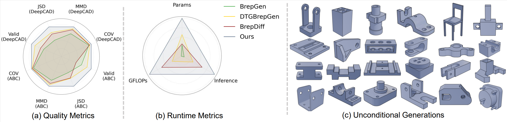

# TG-Diff: Coupling Discrete Topology Diffusion and Topology-conditioned Geometry Diffusions for B-Rep Generation

[](https://arxiv.org/abs/2607.21928)



TG-Diff is a lightweight two-stage diffusion framework for B-rep generation that decouples topology and geometry modeling. It adopts a surface-centric representation to generate high-quality watertight CAD B-reps efficiently.

## Requirements

### Environment (Tested)
- Linux
- Python 3.10
- CUDA 12.4 
- PyTorch 2.5 

### Dependencies

Install PyTorch and other dependencies:
```
conda create --name tgdiff python=3.10 -y
conda activate tgdiff
conda install pytorch==2.5.0 torchvision==0.20.0 torchaudio==2.5.0 pytorch-cuda=12.4 -c pytorch -c nvidia
conda install -c conda-forge pythonocc-core==7.5.1
pip install torch_geometric
pip install -r requirements.txt
pip install chamferdist
```

Install OCCWL following the instruction [here](https://github.com/AutodeskAILab/occwl).
If there are missing packages, simply pip install them yourself.


## Dataset
Download [ABC](https://archive.nyu.edu/handle/2451/43778) STEP files (100 folders). 
Download [Furniture Data](https://cad.onshape.com). Use data_process/down_furniture.py. 
The split file of the training data is available (https://drive.google.com/drive/folders/1BwSRTzOFHUcx_YEOcfxLb3WokpQ8kXmO)

deepcad_f030
1. python data_process/data_step2pkl.py --mode deepcad --option train --MIN_FACE 0 --MAX_FACE 30 --FILTER_EDGE_PER_FACE 20 --OUTPUT_FOLDER /data/deepcad_f030
2. python data_process/data_pkl2h5.py --mode deepcad --option train --MIN_FACE 0 --MAX_FACE 30 --FILTER_EDGE_PER_FACE 20 --PRE_OUTPUT_FOLDER /data/deepcad_f030 --H5_FILE_PREFIX f030

abc_f050
1. python data_process/data_step2pkl.py --mode deepcad --option train --MIN_FACE 0 --MAX_FACE 50 --FILTER_EDGE_PER_FACE 30 --OUTPUT_FOLDER /data/deepcad_f050
2. python data_process/data_pkl2h5.py --mode deepcad --option train --MIN_FACE 0 --MAX_FACE 50 --FILTER_EDGE_PER_FACE 30 --PRE_OUTPUT_FOLDER /data/deepcad_f050 --H5_FILE_PREFIX f050


## Training 
Just need to modify the config, as shown in the following example.
deepcad_f030
1. CUDA_VISIBLE_DEVICES=0,1,2,3 python train_vae_geom.py --cfg_path  ./config/vae_geom_deepcad_f0_30.yaml
2. CUDA_VISIBLE_DEVICES=0,1,2,3 python train_diffusion_topo.py --cfg_path  ./config/diffusion_topo_deepcad_f0_30.yaml
3. CUDA_VISIBLE_DEVICES=0,1,2,3 python train_diffusion_geom.py --cfg_path  ./config/diffusion_geom_deepcad_f0_30.yaml

abc_f050
1. CUDA_VISIBLE_DEVICES=0,1,2,3 python train_vae_geom.py --cfg_path  ./config/vae_geom_abc_f0_50.yaml
2. CUDA_VISIBLE_DEVICES=0,1,2,3 python train_diffusion_topo.py --cfg_path  ./config/diffusion_topo_abc_f0_50.yaml
3. CUDA_VISIBLE_DEVICES=0,1,2,3 python train_diffusion_geom.py --cfg_path  ./config/diffusion_geom_abc_f0_50.yaml
4. 
## Testing
Just need to modify the config, as shown in the following example.At the same time, it is necessary to modify the weight addresses inside the config.
1. python test_diffusion_topo.py --cfg_path  ./config/diffusion_topo_deepcad_f0_30.yaml
2. python test_diffusion_geom.py --cfg_path  ./config/diffusion_geom_deepcad_f0_30.yaml
3. python cut_faces.main.py --data_path ./xxx --exp_path ./xxx --name 0 --recut_all False


## Checkpoint
Zip compression of checkpoints in (https://drive.google.com/drive/folders/1I4rGc7EIkaMG3wmkmf6XGskOiE8G5SJ0)


